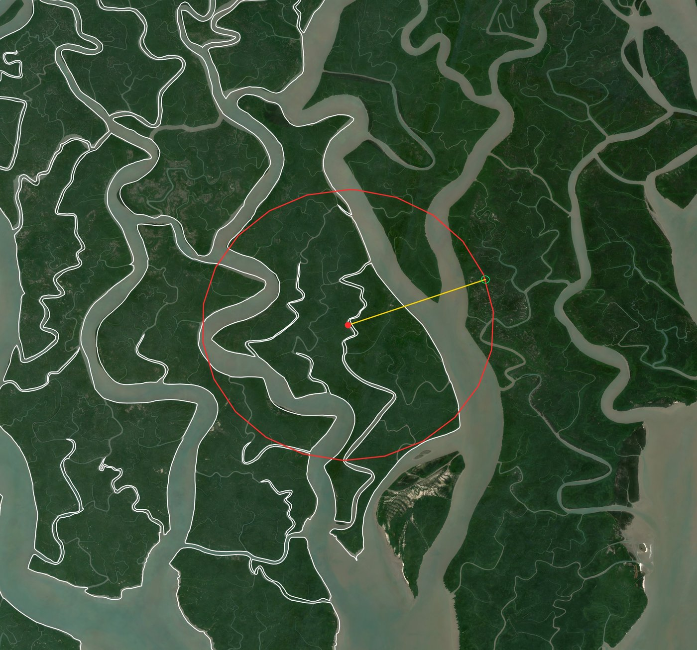
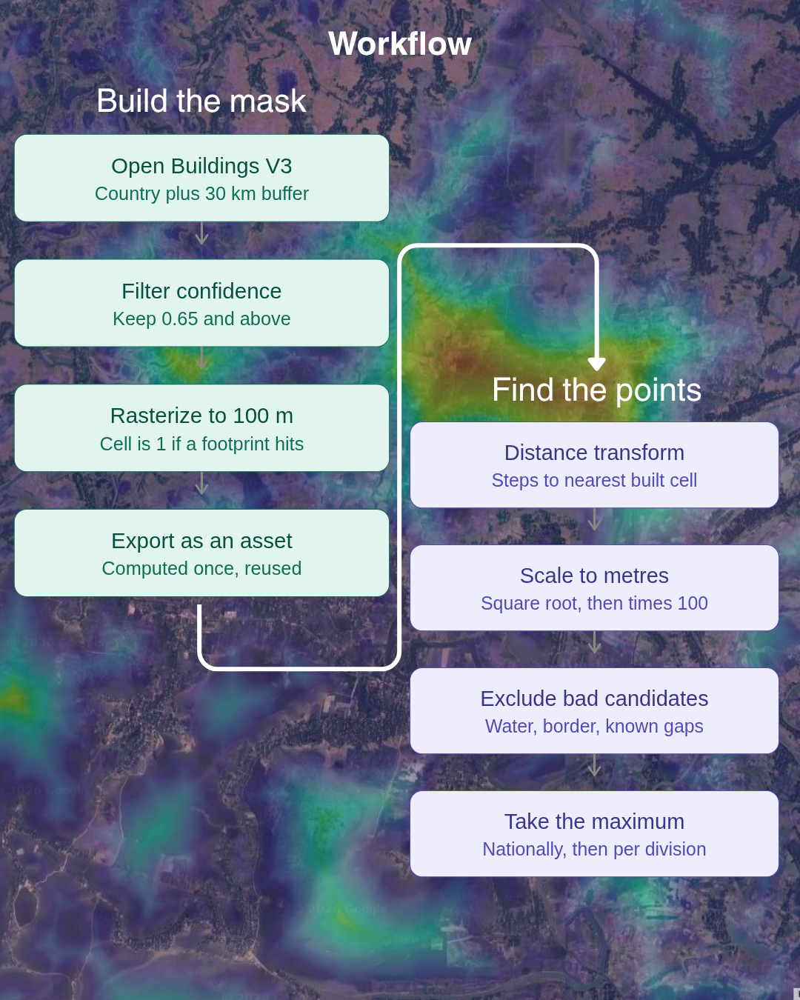
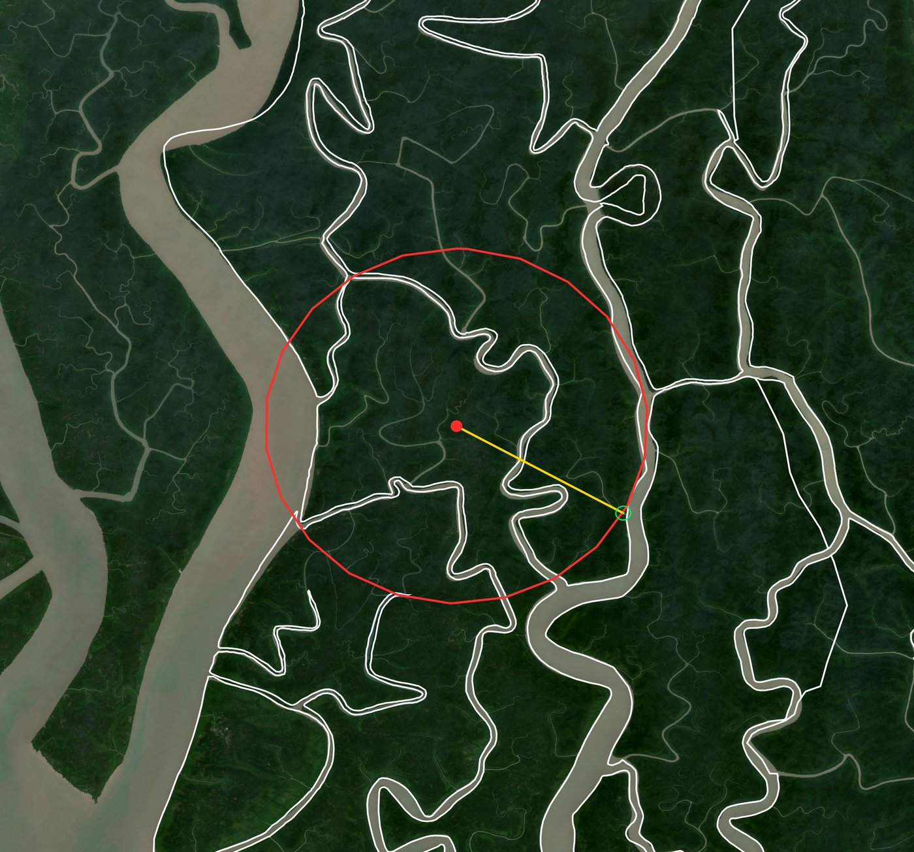
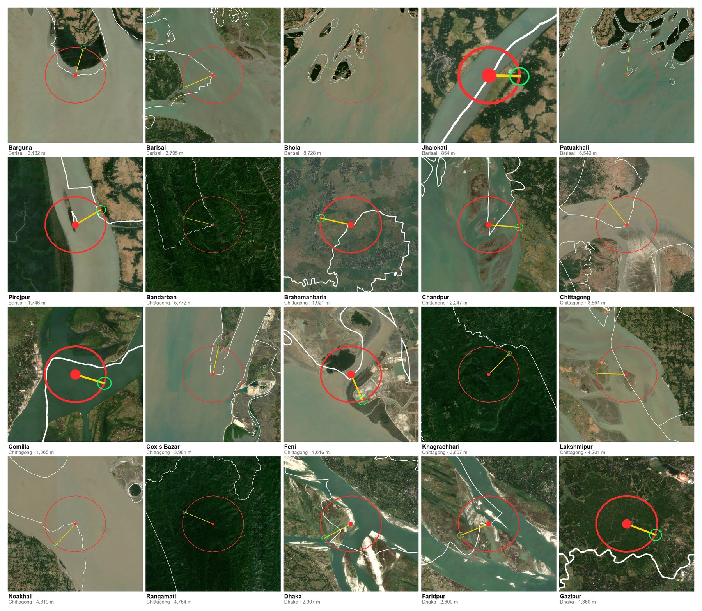

# Most remote point in Bangladesh

Finds the point in Bangladesh that is furthest from any building, using Google Earth Engine and the Open Buildings V3 dataset.

**Result: 9,552 m from the nearest building, at 21.96156° N, 89.29299° E** — in the Sundarbans mangrove forest, southwest Bangladesh.

For a country of ~148,000 km², that is a striking figure: nowhere in Bangladesh is more than about 10 km from a building.



*The winner, in Satkhira district. The red dot is the remote point, the red
circle is the empty radius around it, the yellow line runs to the nearest
detected building and the green ring marks that building. The circle is
tangent to it — a visual proof that nothing is closer.*

---

## How it works

<p align="center">
  
</p>

The problem is a *pole of inaccessibility* — the centre of the largest empty circle that fits between buildings. It is solved as a raster distance transform:

1. Mark every 100 m grid cell that contains a building.
2. For every unmarked cell, compute the distance to the nearest marked cell.
3. Discard cells that are outside Bangladesh, in permanent water, or inside a known data gap.
4. The survivor with the largest distance wins.

Two design decisions are worth stating up front.

**Buildings outside the border still count.** The building mask is built over Bangladesh plus a 30 km buffer, and the clip to the national boundary happens *after* the distance transform. A point 300 m from a village in West Bengal is not remote, and should not be scored as such.

**The mask is exported once.** Rasterizing 1.8 billion building footprints is the only expensive step. It is written to an Earth Engine asset, so the analysis scripts read a small raster and rerun in seconds.

---

## Scripts

Run them in order. Each is a standalone Earth Engine Code Editor script.

### `1_exporting_100m_grid.js`

Builds the building mask and exports it as an asset.

- Loads Bangladesh from `USDOS/LSIB_SIMPLE/2017` and buffers it by 30 km.
- Loads `GOOGLE/Research/open-buildings/v3/polygons`, filtered to `confidence >= 0.65`.
- Rasterizes with `reduceToImage`, then `.gt(0).unmask(0)` for a binary built/not-built mask at 100 m.
- Exports to an asset via the Tasks tab.

Rasterization is intersection-based: a cell is marked if any footprint overlaps it anywhere, so small rural buildings are not lost at coarse scale.

**Run this once and wait for the task to finish before continuing.**

### `2_country_level_remote_point.js`

Finds the single most remote point nationally.

- Loads the exported mask and runs `fastDistanceTransform` (400 px ≈ 40 km search cap).
- Converts squared pixel distance to metres: `.sqrt().multiply(100)`.
- Optionally masks permanent water (`WATER_MASK`).
- Clips to Bangladesh, then finds the maximum with `Reducer.max(3)` over the distance band plus `ee.Image.pixelLonLat()`, which recovers the winning pixel's coordinates.
- Draws a circle of the minimum radius and a line to the nearest building, and prints a Google Maps link.

The circle should be tangent to exactly one building — a visual proof that the answer is correct.

### `3_division_level_remote_point.js`

Repeats the analysis per division (ADM1).

- Uses `reduceRegions` over an upazila-level boundary collection, then keeps the best upazila in each division. This is much cheaper than dissolving polygons to division level, and gives upazila detail for free.
- Excludes known data gaps (see below) via `EXCLUDE_GAPS`.
- Draws a circle, a line and the nearest building for each division's winner.

### `4_district_level_remote_point.js`

Repeats the analysis per district (ADM2) and exports a picture of each result.

Same `reduceRegions` trick as script 3, but keeping the best upazila in each
*district* rather than each division. Each winner is rendered over a
Sentinel-2 dry-season median as a single image carrying the district outline,
the remote point, the empty circle around it, the line to the nearest
building, and the building itself inside a locator ring.



*One district's output: Bagerhat, 6,754 m. The white lines are administrative
boundaries, which in the Sundarbans follow the tidal creeks.*

Run one district first. `TEST_DISTRICT` takes a district name and limits
everything — reduction, drawing and export — to that district; set it to
`null` for all 64. The per-district map layers are drawn only in test mode,
because 5 layers × 64 districts will hang the Code Editor.

Two ways to get the picture out:

| | `PRINT_PNG` | `ZOOM_EXPORT` |
|---|---|---|
| Output | PNG link in the console | GeoTIFF in Drive |
| Wait | seconds | ~2 min per district |
| Good for | checking one district | running all 64 |

The compute is identical either way — the batch-task overhead is most of that
two minutes, not the analysis. Earth Engine can only export GeoTIFF or
TFRecord, so `getThumbURL` is the only route to a finished image, and it is
the better one when you just want to look at a result. It has a size ceiling,
hence `PNG_MAX_PX`; the GeoTIFF has none but carries georeferencing you do not
need unless you are loading the result back into GIS.

`DRIVE_FOLDER` takes a **folder name, not a path**. Earth Engine matches a
folder by name at any depth in Drive, so `Project_Further` finds
`GEE_Exports/Project_Further`. If two folders share that name, exports go to
whichever was modified most recently.

Framing and overlay weight are set at the top of the file:

- `ZOOM_MARGIN` — how much ground the image covers, as a multiple of the
  circle radius. `1.2` is the circle just fitting; `2.4` shows it at half that
  size with the surrounding villages for context.
- `W_*` and `SZ_POINT` — stroke widths **in pixels of the exported image**,
  not metres.
- `HALO_M` — radius of the ring around the nearest building. A rural house is
  about one pixel at 10 m/px, so without a ring it is invisible; the building
  is also painted *after* the line, which would otherwise cover it.

Exported filenames carry the answer:
`p4_<division>_<district>_<distance>m_zoom_<lat>_<lon>`, with each decimal
point written as `_` because Earth Engine rejects punctuation in task
descriptions. The distance in the name is the **100 m raster** figure; the
console prints the more precise geodesic distance, and that is what sets the
circle radius.

---

## Helper scripts

Two small Python utilities, needing only Pillow. Neither touches Earth Engine.

### `tif_to_image.py`

Converts the exported GeoTIFFs to JPG or PNG. The exports are already 8-bit
RGB, so this is a repack, not a rescale — no contrast stretching is applied.

```
python tif_to_image.py Project_Further --fmt jpg
python tif_to_image.py Project_Further --max-px 2000    # shrink for sharing
```

### `make_grid.py`

Tiles the district images into contact-sheet pages, 5 × 4 by default, so 64
districts fill four pages. Sorted by division then district. Captions come
from the filenames, so those must keep the shape script 4 gives them.

```
python make_grid.py Project_Further --pdf
python make_grid.py Project_Further --no-labels --cols 5 --rows 4
```

Images are centre-cropped to square, which is safe because the remote point
is centred in every export. Drive's duplicate `(1)` copies are ignored.



*Page 1 of 4. Note how the circle weight varies between cells — see
"Known limitations".*

---

## District results

All 64 districts, ranked by distance from the remote point to the nearest
building. Figures are the 100 m raster distance.

| | District | Division | Distance | Coordinates |
|---|---|---|---|---|
| 1 | Satkhira | Khulna | 9,541 m | 21.9607, 89.2921 |
| 2 | Khulna | Khulna | 9,368 m | 22.1062, 89.3244 |
| 3 | Bhola | Barisal | 8,728 m | 21.8771, 90.8228 |
| 4 | Bagerhat | Khulna | 6,754 m | 22.1188, 89.6487 |
| 5 | Patuakhali | Barisal | 6,549 m | 21.7882, 90.3799 |
| 6 | Bandarban | Chittagong | 5,772 m | 21.2860, 92.6796 |
| … | | | | |
| 62 | Joypurhat | Rajshahi | 900 m | 24.9925, 89.0621 |
| 63 | Jhalokati | Barisal | 854 m | 22.3972, 90.1356 |
| 64 | Panchagarh | Rangpur | 800 m | 26.3965, 88.5079 |

The median district tops out at about 2.1 km, so in half of Bangladesh's
districts you cannot get further than roughly two kilometres from a building.

Satkhira's winner sits within ~15 m of the national result from script 2,
which is the expected agreement: it is the same point in the Sundarbans, and
the small difference comes from the gap mask applied here.

The top of the table is the Sundarbans and the char islands of the Meghna
estuary; the bottom is the densely settled northwest. Bandarban and Rangamati
are the only inland districts near the top, and both are hill terrain where
detection under canopy is weakest — treat those two as upper bounds rather
than measurements.

---

## Requirements

- A Google Earth Engine account with a Cloud project.
- The Bangladesh administrative boundaries, uploaded as an Earth Engine table asset (see below).
- For the helper scripts only: Python with Pillow (`pip install pillow`).

Set `ASSET` and `ADM_ASSET` to your own project paths before running. The `xxxxxx` in the asset paths is a redacted Cloud project ID — replace it with your own.

### Getting the admin boundaries

The boundary file is not included in this repository — it is over 100 MB, and the authoritative version is maintained elsewhere. Download it yourself:

1. Go to the [Bangladesh Subnational Administrative Boundaries](https://data.humdata.org/dataset/cod-ab-bgd) dataset on HDX.
2. Download the shapefile archive. These are the OCHA Common Operational Datasets, so the attribute names (`ADM1_EN`, `ADM2_EN`, `ADM3_EN`) match what the scripts expect.
3. Unzip it. You need the ADM3 (upazila) layer — the file name will contain `adm3`.

Then upload it to Earth Engine:

1. In the Code Editor, open the **Assets** tab in the left panel.
2. Click **New → Table upload → Shapefiles**.
3. Select the `.shp` file *together with* its `.dbf`, `.shx` and `.prj` siblings, or zip them and upload the zip. All four are required — uploading the `.shp` alone will fail or lose the attributes.
4. Give it an asset name and wait for the ingestion task to finish.
5. Click the finished asset to see its full path, and paste that into `ADM_ASSET`.

The scripts read `ADM1_EN` (division), `ADM2_EN` (district) and `ADM3_EN` (upazila). If a future version of the COD file renames these, adjust the `select` list and the grouping reference — `p.ADM1_EN` in script 3, `p.ADM2_EN` and the `ADM2_EN` filter in script 4.

District spelling in `TEST_DISTRICT` must match `ADM2_EN` exactly, including case. If the console reports `upazilas matched: 0`, the name is spelled differently in your copy of the file.

Attribution and licensing for the boundary data are as stated on the HDX dataset page.

---

## Known limitations

**This measures distance to the nearest *detected* building.** Where Open Buildings V3 has complete coverage, that equals distance to the nearest building. Where it does not, a detection gap is indistinguishable from genuine remoteness — and the method actively seeks out gaps, because a gap looks exactly like what it is searching for.

One tile-sized gap was found in Sunamganj (around 91.47–91.65° E, 25.08–25.14° N) during visual verification: a suspiciously smooth rectangular gradient over terrain that clearly contains villages in satellite imagery. Open Buildings V3 has no detections there, at any confidence threshold. The Open Buildings 2.5D Temporal dataset — derived from Sentinel-2, which has consistent global coverage — *does* show buildings at that location (presence 0.88, height 7.3 m).

That region is listed in `GAPS` and excluded from the division-level analysis. Attempts to patch it from the temporal dataset repeatedly hit Earth Engine's reprojection and pixel limits; excluding the region was chosen over an unreliable repair.

**Always verify winners against satellite imagery before quoting them.** Straight edges and right angles in the distance surface are the signature of a data gap, not of geography.

**Overlay weight is not comparable between districts.** The `W_*` widths are
in pixels of the exported image, and a remote district produces a much larger
image than a crowded one. In a grid of all 64, Jhalokati (854 m) has a heavy
circle and Bhola (8,728 m) a hairline, purely because of that. It is a
cosmetic issue, but it makes the pictures misleading side by side; fixing it
means scaling the widths with image size and re-exporting.

Other caveats:

- Distances are straight-line, not walkable. In the Sundarbans tidal channels the difference is large.
- The grid is EPSG:4326 at 100 m nominal. At 22° N a pixel is ~103 m east–west, so figures are accurate to a few percent, not to the metre. The scripts print a grid-free geodesic distance for comparison.
- `confidence >= 0.65` is Google's suggested high-precision threshold. Lowering it to 0.5 catches more marginal detections, especially in hill terrain and under canopy, and will tend to reduce the reported distances.
- `WATER_MASK` uses JRC occurrence > 80%, which only captures *permanent* water. Tidal channels that drain twice daily are not masked.

---

## Data sources

- [Open Buildings V3](https://sites.research.google/open-buildings/) — building footprints from 50 cm imagery.
- [Open Buildings 2.5D Temporal](https://sites.research.google/gr/open-buildings/temporal/) — Sentinel-2 derived building presence and height, used here for gap verification.
- `USDOS/LSIB_SIMPLE/2017` — international boundaries.
- `JRC/GSW1_4/GlobalSurfaceWater` — surface water occurrence.
